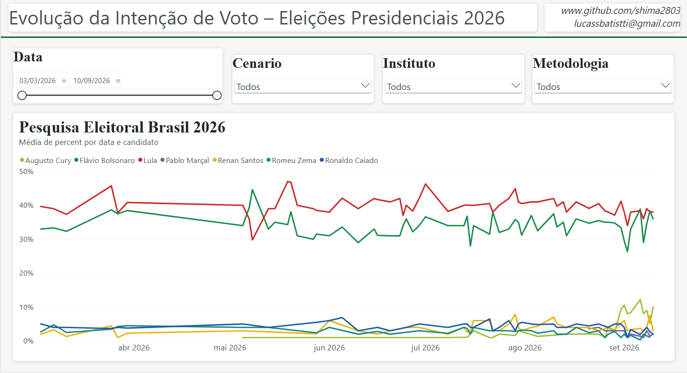
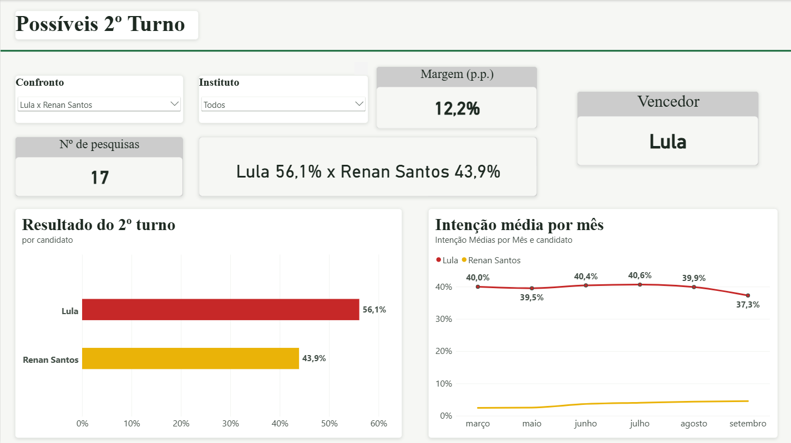
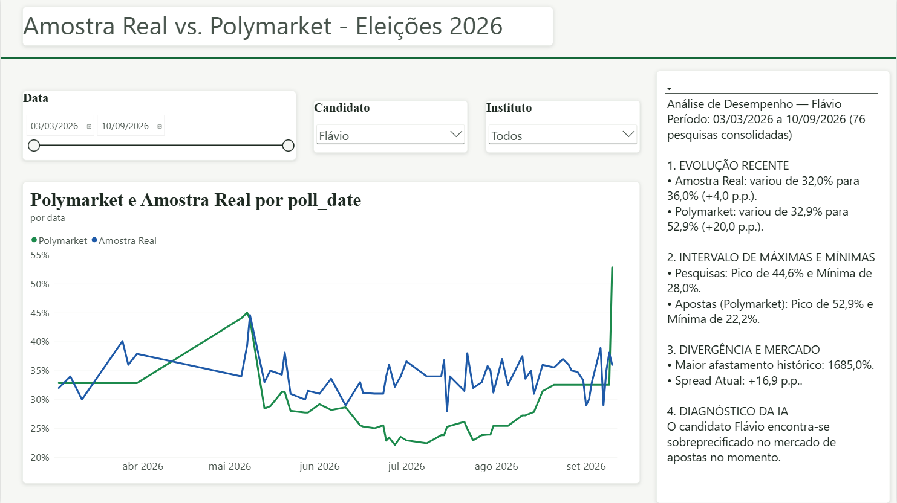

# 🇧🇷 Eleições Presidenciais 2026 — Painel de Pesquisas, 2º Turno e Mercado de Apostas

Painel de **inteligência eleitoral** para a eleição presidencial brasileira de **2026**, construído em **Power BI** a partir de pesquisas registradas no TSE, divulgações dos institutos e dados do mercado de apostas (Polymarket).

O projeto acompanha a **evolução da intenção de voto** no 1º turno, simula os **possíveis confrontos de 2º turno** com base em pesquisas reais de confronto direto, e compara o que as **pesquisas** medem com o que o **mercado de apostas** precifica.

> **Aviso de leitura:** todos os números aqui são **médias de pesquisas** (dados de opinião), não previsões. Os percentuais de 2º turno são normalizados para votos válidos e **não representam probabilidade de vitória**. Este material tem fim analítico e não constitui recomendação de investimento.

---

## 📑 Sumário

- [De onde vêm os dados](#-de-onde-vêm-os-dados)
- [Estrutura e tratamento dos dados](#-estrutura-e-tratamento-dos-dados)
- [Os painéis](#-os-painéis)
  - [1. Evolução da Intenção de Voto (1º turno)](#1-evolução-da-intenção-de-voto--1º-turno)
  - [2. Possíveis 2º Turno](#2-possíveis-2º-turno)
  - [3. Amostra Real vs. Polymarket](#3-amostra-real-vs-polymarket)
- [Principais medidas (DAX)](#-principais-medidas-dax)
- [Tema visual](#-tema-visual)
- [Metodologia e limitações](#-metodologia-e-limitações)
- [Autor](#-autor)

---

## 📥 De onde vêm os dados

Os dados combinam um repositório público no GitHub, fontes oficiais de pesquisas eleitorais e dados do mercado de apostas.

### Repositório do projeto (fonte direta do painel)

- **GitHub ([github.com/shima2803](https://github.com/shima2803)):** os arquivos e os visuais do painel são mantidos neste repositório, que é atualizado compilando tanto os levantamentos dos institutos quanto as cotações da Polymarket em arquivos CSV.

### Pesquisas eleitorais (fontes primárias e oficiais)

- **PesqEle (TSE):** sistema oficial de registro de pesquisas do Tribunal Superior Eleitoral. Todo instituto é obrigado por lei a registrar a pesquisa antes de publicar — isso aparece na coluna `register_tse` (ex.: registro `BR-04227/2026`).
- **Institutos e veículos de mídia:** divulgações diretas dos institutos presentes na base — **Datafolha, Quaest, AtlasIntel, Real Time Big Data, PoderData, Paraná Pesquisas**, entre outros.
- **Agregadores de imprensa:** portais que mantêm históricos abertos de pesquisas nacionais, como o **Agregador do Poder360** e o **Agregador do Estadão**.

### Mercado de apostas (Polymarket)

- **API pública da Polymarket:** plataforma global de mercados de previsão (*prediction markets*). Os dados de probabilidade e variação histórica são extraídos da API pública ou via *web scraping* do site polymarket.com.

---

## 🧱 Estrutura e tratamento dos dados

O modelo tem três tabelas principais: **`main`** (1º turno), **`Pesquisas vs Mercado`** (pesquisa × Polymarket) e **`Simulações de 2º Turno`** (confrontos diretos).

### Tabela `main` (1º turno)

Cada linha é um resultado de um candidato em uma pesquisa/cenário. Colunas:

| Coluna | Descrição |
|---|---|
| `poll_id` / `register_tse` | Identificação e registro da pesquisa no TSE |
| `institute` | Instituto responsável |
| `poll_date` | Data da pesquisa |
| `field_dates` | Período de coleta em campo |
| `sample` | Tamanho da amostra |
| `margin_pp` | Margem de erro (pontos percentuais) |
| `method` | Método (Telefônica, Presencial…) |
| `scenario` | Cenário simulado (ex.: "Cenário com Ratinho Jr", "Com Haddad (sem Lula)") |
| `candidate` | Candidato |
| `party` | Partido |
| `percent` | Intenção de voto (%) |

**Cuidado com a coluna `scenario`:** a base não tem um único 1º turno — ela guarda **vários cenários**, cada um com um conjunto de candidatos e percentuais diferentes. Para qualquer análise coerente, filtra-se **um cenário por vez**, senão pesquisas incompatíveis (com conjuntos diferentes de candidatos) seriam somadas.

### Tabela de 2º turno — da forma "larga" para a forma "alta"

A tabela original de confrontos trazia, em cada linha, **dois candidatos e dois percentuais** (`candidate1` / `percent1` / `candidate2` / `percent2`) mais o texto do confronto (`matchup`). Isso gerava três problemas:

1. o mesmo candidato aparecia ora em `candidate1`, ora em `candidate2`;
2. o par vinha em ordens diferentes ("Zema vs Lula" e "Lula vs Zema" eram tratados como confrontos distintos);
3. havia inconsistência de caixa nos nomes ("flávio bolsonaro" vs "Flávio Bolsonaro").

**Tratamento no Power Query:**

- Limpeza dos nomes com **Aparar** + **Colocar Cada Palavra em Maiúscula**;
- criação de uma **chave de confronto que ignora a ordem** (`Confronto`), com a lógica
  `if [candidate1] <= [candidate2] then [candidate1] & " x " & [candidate2] else [candidate2] & " x " & [candidate1]`;
- **empilhamento (append)** das duas colunas de candidato em uma só, gerando a tabela **`Duelos 2T`** no formato alto: `poll_date`, `institute`, `Confronto`, `candidato`, `pct`.

Com isso, cada linha passa a ser **um candidato em uma pesquisa de confronto**, e os percentuais são **normalizados para votos válidos** (os dois somam 100%).

---

## 📊 Os painéis

### 1. Evolução da Intenção de Voto — 1º turno



**O que mostra.** A trajetória da intenção de voto de todos os candidatos ao longo da campanha, de março a setembro de 2026.

**Por que gráfico de linha.** É o visual ideal para **tendência ao longo do tempo** e para comparar **muitas séries** simultaneamente. Ele deixa claro o distanciamento entre os dois líderes (Lula e Flávio Bolsonaro), o "pelotão" de candidatos menores na base do gráfico, e a **volatilidade entre pesquisas** (os picos e vales de cada instituto).

**Visões que apresenta.**
- Liderança e distância entre os dois primeiros colocados;
- movimentos recentes (a subida de alguns nomes em setembro);
- comportamento dos candidatos secundários agrupados na faixa de 0–10%.

**Filtros.** `Data` (intervalo), `Cenario`, `Instituto` e `Metodologia` — permitem isolar, por exemplo, "só o Datafolha", "só pesquisa presencial" ou um cenário específico.

**Tratamento.** Média de `percent` por data e candidato; eixo em **formato de porcentagem**; cada candidato com **cor fixa**.

---

### 2. Possíveis 2º Turno



**O que mostra.** O resultado dos **confrontos diretos de 2º turno** a partir de pesquisas reais de runoff, mais um **panorama de indicadores** do confronto escolhido.

**Como foi construído.** Roda sobre a tabela **`Duelos 2T`** (a versão reorganizada da base de confrontos). O usuário escolhe o par no slicer **`Confronto`** (cada opção é uma dupla, e só aparecem confrontos que existem nas pesquisas).

**Componentes e por que cada um.**
- **Faixa de KPIs** no topo — `Margem (p.p.)`, `Vencedor` e `Nº de pesquisas`: resolvem a leitura "de relance" e evitam a página ficar vazia;
- **Cartão do placar** — "Lula 56,1% x Renan Santos 43,9%": o número principal, direto;
- **"Resultado do 2º turno"** (gráfico de barras) — comparação dos dois candidatos, cada um com **sua cor fixa** (Lula vermelho, Renan amarelo…); as barras somam 100% (votos válidos);
- **"Intenção média por mês"** (gráfico de linha) — a trajetória dos dois no período.

**Visões que apresenta.** Quem vence o confronto e por quanto; o placar em votos válidos; a evolução dos dois candidatos no tempo; e quantas pesquisas sustentam aquele número.

**Tratamento.** Percentuais **normalizados para votos válidos**; **formato dinâmico** em DAX para exibir "%" sem quebrar as barras; mapa de **cor fixa por candidato**.

> **Importante:** os números são **médias das pesquisas** de confronto, normalizadas — **não** são probabilidade de vitória.

---

### 3. Amostra Real vs. Polymarket



**O que mostra.** A comparação, ao longo do tempo, entre o que as **pesquisas** medem ("Amostra Real") e o que o **mercado de apostas** precifica ("Polymarket") para um candidato.

**Por que essa comparação.** Pesquisa e mercado de apostas medem coisas diferentes (opinião declarada × dinheiro apostado). Colocá-los lado a lado revela **onde eles concordam e onde divergem** — e o tamanho dessa divergência (*spread*).

**Componentes.**
- **Gráfico de linha duplo** (pesquisa × mercado) — para acompanhar as duas curvas e seus cruzamentos;
- **Painel de análise** à direita — um resumo automático com evolução recente, intervalo de máximas/mínimas e o *spread* atual.

**Filtros.** `Data`, `Candidato` e `Instituto`.

> **Nota de responsabilidade:** o texto do painel de análise é um **resumo descritivo** da diferença entre pesquisa e mercado. Termos como "sobreprecificado" devem ser lidos como **descrição de divergência** (o mercado está acima da média das pesquisas), **não** como recomendação de compra/venda nem como previsão do resultado.

---

## 🧮 Principais medidas (DAX)

```dax
-- Média simples do percentual (respeita os filtros da página)
% Médio = AVERAGE ( 'Duelos 2T'[pct] )

-- Resultado do confronto normalizado para votos válidos (os dois somam 100%)
% no Confronto =
DIVIDE (
    [% Médio],
    CALCULATE (
        SUMX ( VALUES ( 'Duelos 2T'[candidato] ), [% Médio] ),
        REMOVEFILTERS ( 'Duelos 2T'[candidato] )
    )
) * 100

-- Margem entre o 1º e o 2º colocado no confronto
Margem pp =
MAXX ( VALUES ( 'Duelos 2T'[candidato] ), [% no Confronto] )
  - MINX ( VALUES ( 'Duelos 2T'[candidato] ), [% no Confronto] )

-- Vencedor do confronto
Vencedor =
VAR t =
    CALCULATETABLE (
        ADDCOLUMNS ( VALUES ( 'Duelos 2T'[candidato] ), "@v", [% Médio] ),
        REMOVEFILTERS ( 'Duelos 2T'[candidato] )
    )
RETURN MAXX ( TOPN ( 1, t, [@v], DESC ), 'Duelos 2T'[candidato] )

-- Placar em texto para o cartão
Placar =
CONCATENATEX (
    CALCULATETABLE (
        ADDCOLUMNS ( VALUES ( 'Duelos 2T'[candidato] ), "@v", [% no Confronto] ),
        REMOVEFILTERS ( 'Duelos 2T'[candidato] )
    ),
    'Duelos 2T'[candidato] & " " & FORMAT ( [@v], "0.0" ) & "%",
    "   x   ", [@v], DESC
)

-- Cor fixa por candidato (usada via formatação condicional "Valor do campo")
Cor do Candidato =
VAR nome =
    COALESCE (
        SELECTEDVALUE ( 'Duelos 2T'[candidato] ),
        SELECTEDVALUE ( main[candidate] )
    )
RETURN
    SWITCH (
        nome,
        "Lula",             "#C62828",
        "Flávio Bolsonaro", "#1C8A4C",
        "Renan Santos",     "#EAB308",
        "Pablo Marçal",     "#7A5EA6",
        "Ronaldo Caiado",   "#1F5AA8",
        "Romeu Zema",       "#178A82",
        "#8A9AA6"
    )
```

O símbolo de "%" nos eixos e rótulos é aplicado com **cadeia de formato dinâmica** (ex.: `"0.0\%"`), que mantém o valor numérico — assim os eixos e o tamanho das barras continuam funcionando.

---

## 🎨 Tema visual

O painel usa um tema personalizado do Power BI (**"Brasil Analítico"**), pensado para um material de inteligência: sóbrio, mas com identidade brasileira.

- **Paleta:** verde-esmeralda, ouro/âmbar e azul-cobalto sobre fundo off-white (`#F6F7F4`);
- **Tipografia:** títulos em **DIN 14 pt, negrito, à esquerda**; rótulos em **Segoe UI**;
- **Cartões:** cantos de **8 px**, borda de fio quase invisível e **sombra suave** (uniforme em todos os visuais);
- **Legenda padrão:** no topo, sem título de legenda;
- **Eixos:** sem título de eixo, com linhas de grade horizontais bem claras.

---

## ⚠️ Metodologia e limitações

- Os dados refletem **pesquisas registradas** e cotações de mercado; médias suavizam diferenças entre institutos e não substituem a leitura pesquisa a pesquisa.
- No 1º turno, valores só são comparáveis **dentro de um mesmo cenário** (`scenario`).
- No 2º turno, os percentuais são **normalizados para votos válidos**; representam a média das pesquisas de confronto, **não** uma probabilidade de vitória.
- A comparação com a Polymarket é **descritiva** — pesquisa e mercado de apostas medem coisas diferentes.
- Este repositório tem finalidade **analítica e educacional**. Não é previsão eleitoral nem recomendação de investimento.

---

## 👤 Autor

**Lucas Battistti**
GitHub: [github.com/shima2803](https://github.com/shima2803) · E-mail: lucassbatistti@gmail.com

*Construído com Power BI Desktop, Power Query (M) e DAX.*
